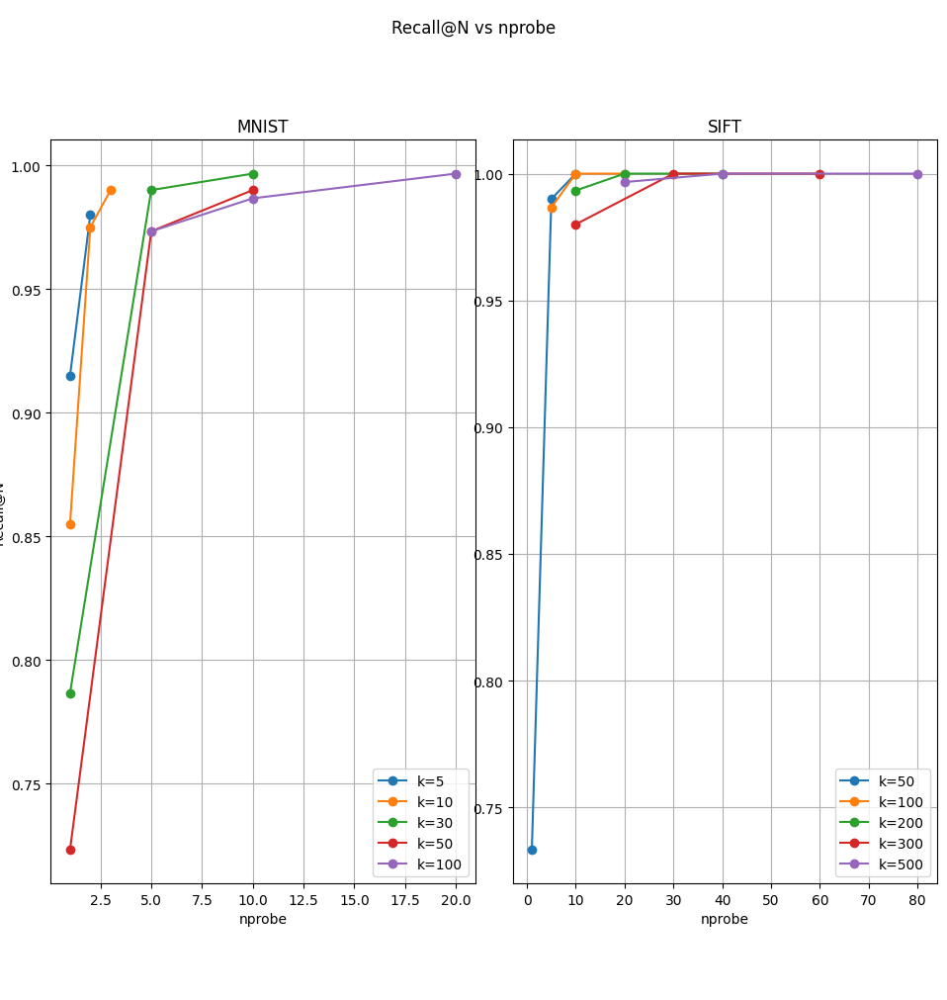
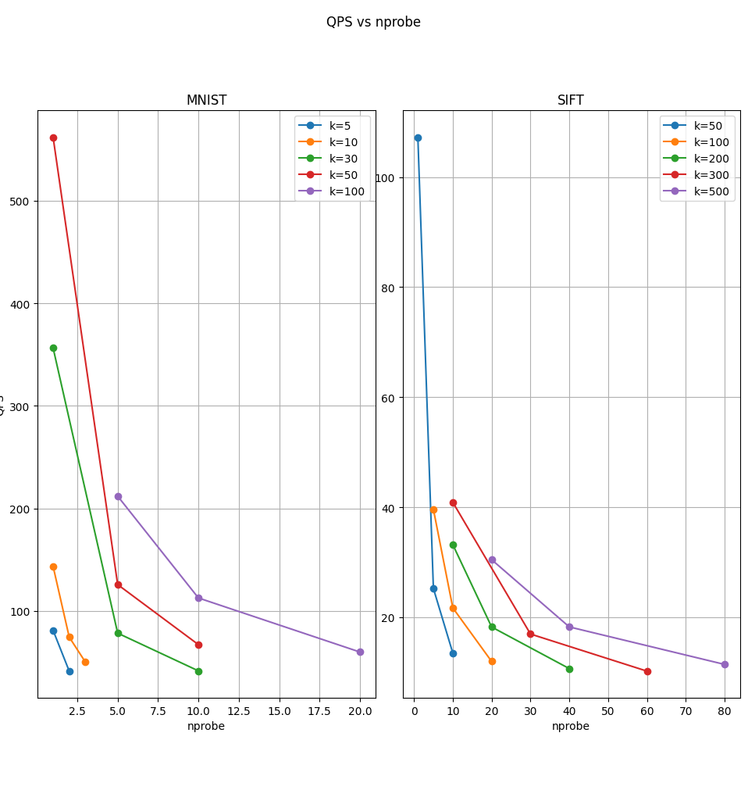
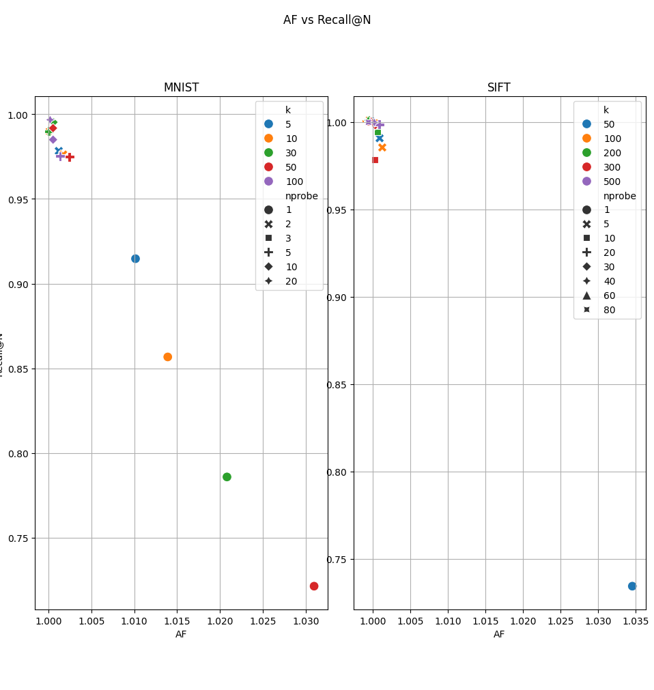
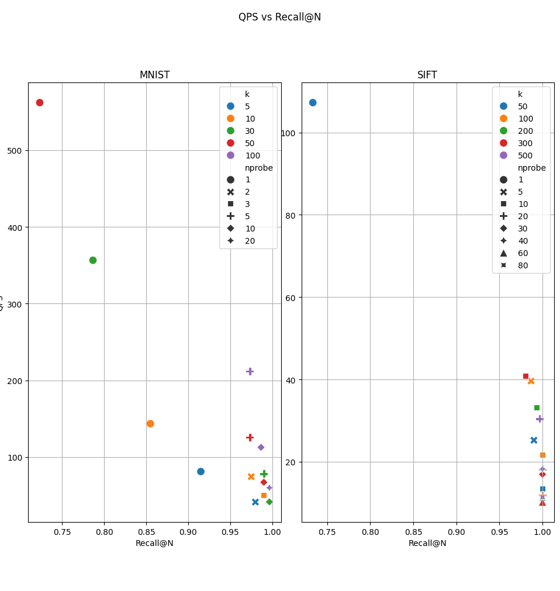
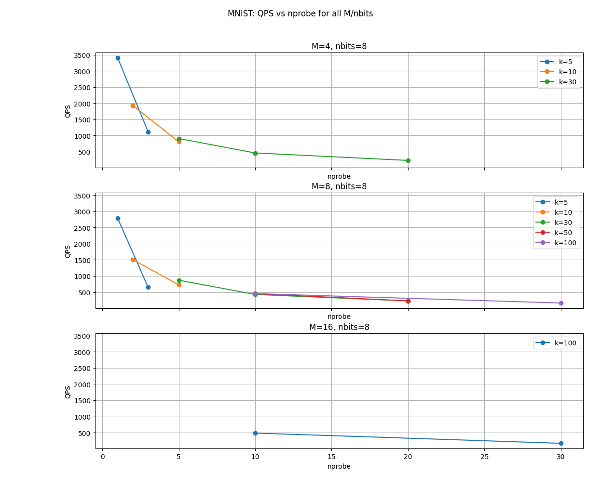
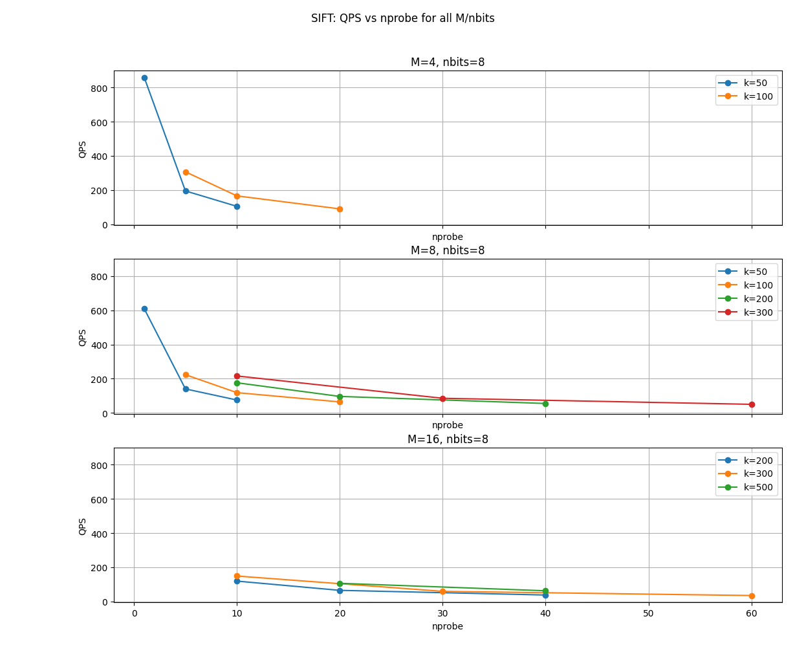
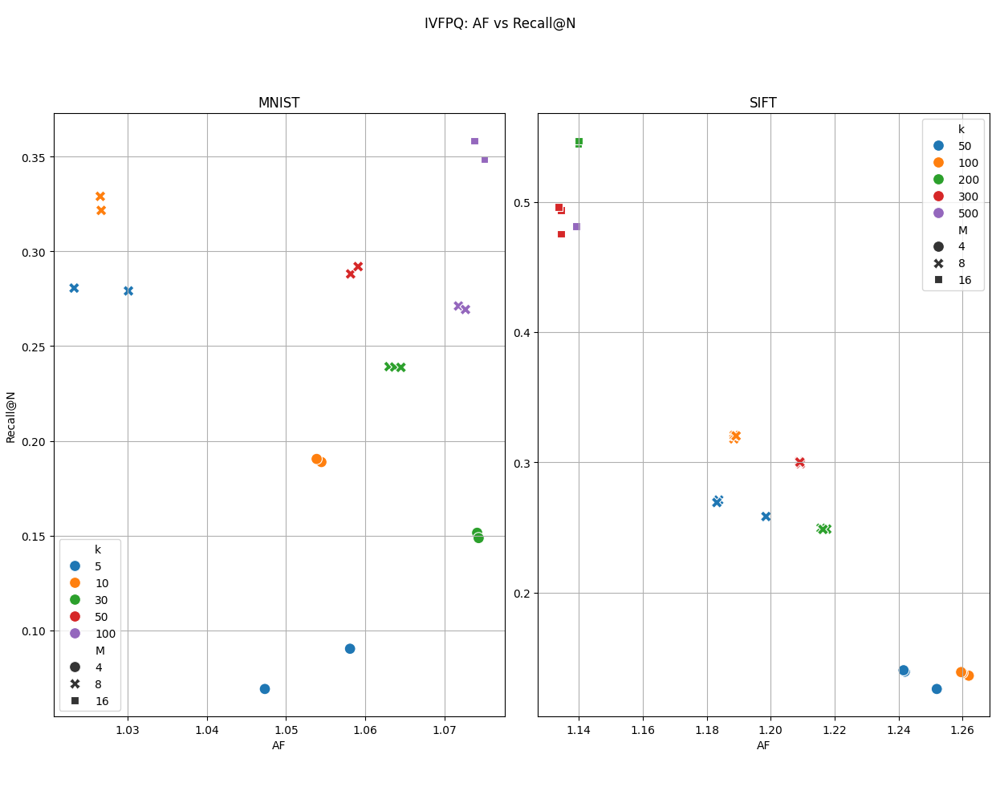
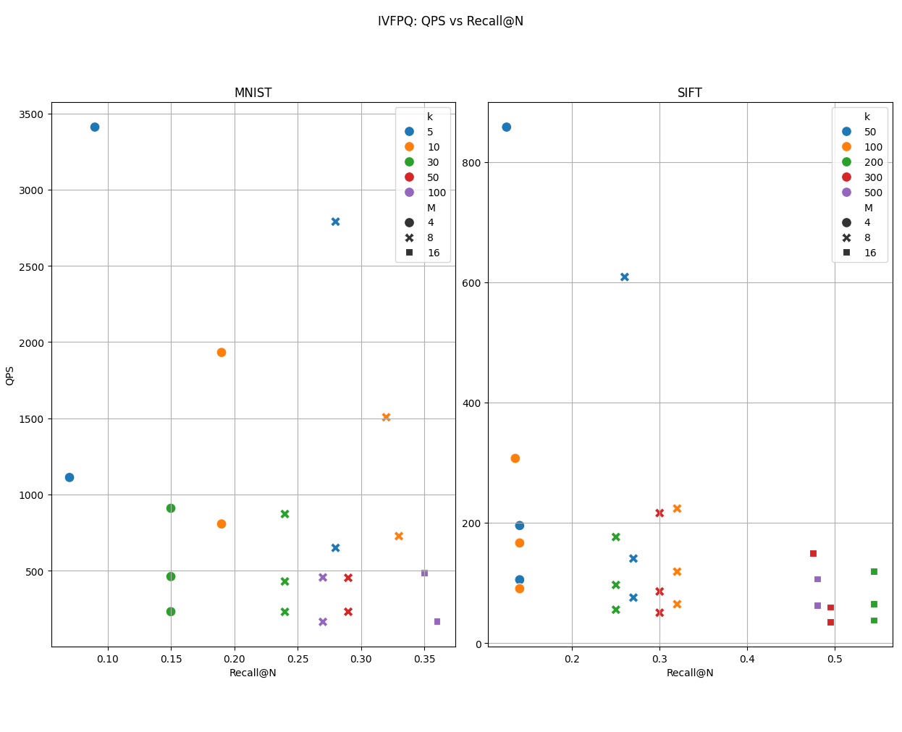

# Clustering Analysis Report: IVF Indices

## 1. Technical Specifications
The experiments were conducted to evaluate the trade-offs between search speed, memory, and accuracy (Recall).

* **Hardware:** 
    * CPU: Intel(R) Core(TM) i7-8700 CPU @ 3.20GHz.
    * RAM: 8Gb DDR4 2666MHz
* **Methodology:**  
    * Experiments were executed for $N=1$ using the first 100 test queries for each dataset.
    * Each parameter configuration was run 3 times, and the results presented are the average values.
    * **Parameters Tested:** `ivfflat(k, nprobe, seed)` and `ivfpq(k, nprobe, M, nbits)`.
    * **Clustering:** `kmeans++` was used for the initial clustering of centroids.
    * **Silhouette Score:** For the SIFT dataset, an approximate Silhouette value was calculated (using 500 vectors per cluster) because the exact calculation was computationally prohibitive.
* **Notation:**  
        The best values for each metric per column are highlighted in **bold**. In cases where bold text is absent, the best value is the mathematically optimal one for that specific metric.

---

## 2. Experimental Results

### IVFFlat Tables

#### SIFT(1M)

|   k |   nprobe |   seed |      AF |   Recall@N |       QPS |   speedup |   tApproximate |    tTrue | silhouette |
|----:|---------:|-------:|--------:|-----------:|----------:|----------:|---------------:|---------:|-----------:|
|  50 |        1 |      1 | 1.03206 |       0.71 | 105.846   |  17.0229  |       0.009448 | 0.160828 |   0.011959 |
|  50 |        1 |      7 | 1.03503 |       0.71 |**109.268**|**17.237** |   **0.009152** | 0.15775  |   0.001902 |
|  50 |        1 |     13 | 1.03789 |       0.78 | 106.618   |  16.7904  |       0.009379 | 0.157482 |   0.002807 |
|  50 |        5 |      1 | 1       |       1    |  25.2872  |   3.98582 |       0.039546 | 0.157622 |   0.011959 |
|  50 |        5 |      7 | 1.00068 |       0.98 |  25.0106  |   3.95894 |       0.039983 | 0.15829  |   0.001902 |
|  50 |        5 |     13 | 1.00006 |       0.99 |  25.3947  |   4.0056  |       0.039378 | 0.157734 |   0.002807 |
|  50 |       10 |      1 | 1       |       1    |  13.768   |   2.16957 |       0.072632 | 0.157581 |   0.011959 |
|  50 |       10 |      7 | 1       |       1    |  13.5138  |   2.16626 |       0.073998 | 0.1603   |   0.001902 |
|  50 |       10 |     13 | 1       |       1    |  13.1963  |   2.09064 |       0.075779 | 0.158426 |   0.002807 |
| 100 |        5 |      1 | 1.0002  |       0.99 |  40.3467  |   6.38855 |       0.024785 | 0.158341 |   0.114306 |
| 100 |        5 |      7 | 1.00317 |       0.97 |  40.8551  |   6.43763 |       0.024477 | 0.157572 |   0.076477 |
| 100 |        5 |   1627 | 1       |       1    |  37.6424  |   5.93754 |       0.026566 | 0.157735 |   0.037329 |
| 100 |       10 |      1 | 1       |       1    |  22.36    |   3.52336 |       0.044723 | 0.157575 |   0.114306 |
| 100 |       10 |      7 | 1       |       1    |  22.1713  |   3.49942 |       0.045103 | 0.157836 |   0.076477 |
| 100 |       10 |   1627 | 1       |       1    |  20.5715  |   3.24572 |       0.048611 | 0.157777 |   0.037329 |
| 100 |       20 |      1 | 1       |       1    |  12.1582  |   1.92339 |       0.082249 | 0.158197 |   0.114306 |
| 100 |       20 |      7 | 1       |       1    |  12.099   |   1.91481 |       0.082652 | 0.158262 |   0.076477 |
| 100 |       20 |   1627 | 1       |       1    |  11.6216  |   1.83319 |       0.086046 | 0.157739 |   0.037329 |
| 200 |       10 |      1 | 1       |       1    |  33.2095  |   5.25301 |       0.030112 | 0.158178 |   0.148605 |
| 200 |       10 |     11 | 1.00013 |       0.98 |  33.6495  |   5.32864 |       0.029718 | 0.158357 |   0.133531 |
| 200 |       10 |     37 | 1       |       1    |  32.7043  |   5.15607 |       0.030577 | 0.157657 |   0.144685 |
| 200 |       20 |      1 | 1       |       1    |  18.2986  |   2.89954 |       0.054649 | 0.158456 |   0.148605 |
| 200 |       20 |     11 | 1       |       1    |  18.7438  |   2.96695 |       0.053351 | 0.15829  |   0.133531 |
| 200 |       20 |     37 | 1       |       1    |  17.6302  |   2.78148 |       0.056721 | 0.157767 |   0.144685 |
| 200 |       40 |      1 | 1       |       1    |  10.6823  |   1.6906  |       0.093613 | 0.158262 |   0.148605 |
| 200 |       40 |     11 | 1       |       1    |  11.033   |   1.74564 |       0.090637 | 0.15822  |   0.133531 |
| 200 |       40 |     37 | 1       |       1    |  10.2717  |   1.62184 |       0.097354 | 0.157893 |   0.144685 |
| 300 |       10 |      1 | 1.00114 |       0.98 |  40.356   |   6.3713  |       0.024779 | 0.157878 |   0.14069  |
| 300 |       10 |     17 | 1.0008  |       0.97 |  41.821   |   6.59965 |       0.023911 | 0.157807 |   0.155669 |
| 300 |       10 |     23 | 1.00006 |       0.99 |  40.4814  |   6.38092 |       0.024703 | 0.157626 |   0.112328 |
| 300 |       30 |      1 | 1       |       1    |  16.9727  |   2.67625 |       0.058918 | 0.15768  |   0.14069  |
| 300 |       30 |     17 | 1       |       1    |  17.2132  |   2.71338 |       0.058095 | 0.157633 |   0.155669 |
| 300 |       30 |     23 | 1       |       1    |  16.6507  |   2.62779 |       0.060058 | 0.157819 |   0.112328 |
| 300 |       60 |      1 | 1       |       1    |  10.2905  |   1.62572 |       0.097177 | 0.157983 |   0.14069  |
| 300 |       60 |     17 | 1       |       1    |  10.3217  |   1.62875 |       0.096883 | 0.157798 |   0.155669 |
| 300 |       60 |     23 | 1       |       1    |   9.99258 |   1.58341 |       0.100074 | 0.158458 |   0.112328 |
| 500 |       20 |      1 | 1.00008 |       0.99 |  30.1275  |   4.75306 |       0.033192 | 0.157765 |   0.122215 |
| 500 |       20 |      7 | 1       |       1    |  31.459   |   4.95857 |       0.031787 | 0.15762  |**0.175385** |
| 500 |       20 |     31 | 1       |       1    |  29.7784  |   4.69796 |       0.033581 | 0.157764 |   0.125865 |
| 500 |       40 |      1 | 1       |       1    |  18.4854  |   2.91128 |       0.054097 | 0.15749  |   0.122215 |
| 500 |       40 |      7 | 1       |       1    |  18.4404  |   2.90803 |       0.054229 | 0.157699 |**0.175385** |
| 500 |       40 |     31 | 1       |       1    |  17.7852  |   2.82101 |       0.056226 | 0.158615 |   0.125865 |
| 500 |       80 |      1 | 1       |       1    |  11.6198  |   1.83443 |       0.08606  | 0.157871 |   0.122215 |
| 500 |       80 |      7 | 1       |       1    |  11.4272  |   1.80338 |       0.087511 | 0.157815 |**0.175385** |
| 500 |       80 |     31 | 1       |       1    |  11.2107  |   1.76427 |       0.0892   | 0.157374 |   0.125865 |

#### MNIST

|   k |   nprobe |   seed |      AF |   Recall@N |      QPS |   speedup |   tApproximate |    tTrue | silhouette |
|----:|---------:|-------:|--------:|-----------:|---------:|----------:|---------------:|---------:|-----------:|
|   5 |        1 |      1 | 1.01479 |       0.89 |  77.004  |   3.46834 |       0.012986 | 0.045041 |   0.07149  |
|   5 |        1 |     37 | 1.00655 |       0.94 |  85.1195 |   3.8263  |       0.011748 | 0.044952 |   0.058715 |
|   5 |        2 |      1 | 1.00124 |       0.97 |  40.7244 |   1.83273 |       0.024555 | 0.045003 |   0.07149  |
|   5 |        2 |     37 | 1.00082 |       0.99 |  41.8097 |   1.8732  |       0.023918 | 0.044803 |   0.058715 |
|  10 |        1 |      1 | 1.014   |       0.85 | 141.061  |   6.32593 |       0.007089 | 0.044846 |   0.062415 |
|  10 |        1 |      2 | 1.01561 |       0.86 | 145.87   |   6.55958 |       0.006855 | 0.044969 |   0.069607 |
|  10 |        2 |      1 | 1.00271 |       0.96 |  73.6232 |   3.30333 |       0.013583 | 0.044868 |   0.062415 |
|  10 |        2 |      2 | 1.00022 |       0.99 |  75.2131 |   3.37856 |       0.013296 | 0.04492  |   0.069607 |
|  10 |        3 |      1 | 1.00138 |       0.98 |  49.2957 |   2.21021 |       0.020286 | 0.044836 |   0.062415 |
|  10 |        3 |      2 | 1       |       1    |  50.9447 |   2.28368 |       0.019629 | 0.044827 |   0.069607 |
|  30 |        1 |      1 | 1.02176 |       0.77 |  386.45  |  17.3447  |       0.002588 | 0.044882 |   0.072267 |
|  30 |        1 |      7 | 1.01715 |       0.78 | 331.607  |  14.9345  |       0.003016 | 0.045037 |   0.069113 |
|  30 |        1 |     13 | 1.02121 |       0.81 | 351.43   |  15.8475  |       0.002846 | 0.045094 |   0.069524 |
|  30 |        5 |      1 | 1.00106 |       0.98 |  86.6565 |   3.90043 |       0.01154  | 0.04501  |   0.072267 |
|  30 |        5 |      7 | 1       |       1    |  73.2219 |   3.29969 |       0.013657 | 0.045064 |   0.069113 |
|  30 |        5 |     13 | 1.00058 |       0.99 |  75.056  |   3.38307 |       0.013323 | 0.045074 |   0.069524 |
|  30 |       10 |      1 | 1.00103 |       0.99 |  45.4883 |   2.04444 |       0.021984 | 0.044944 |   0.072267 |
|  30 |       10 |      7 | 1       |       1    |  39.4221 |   1.77704 |       0.025367 | 0.045077 |   0.069113 |
|  30 |       10 |     13 | 1       |       1    |  39.682  |   1.78671 |       0.0252   | 0.045026 |   0.069524 |
|  50 |        1 |      1 | 1.0337  |       0.72 | 591.767  |  26.6413  |       0.00169  | 0.04502  |   0.061412 |
|  50 |        1 |      3 | 1.03632 |       0.67 |**605.414**|**27.2277**|  **0.001652** | 0.044974 |   0.065994 |
|  50 |        1 |   1821 | 1.02379 |       0.78 | 488.812  |  21.9828  |       0.002046 | 0.044972 |   0.078451 |
|  50 |        5 |      1 | 1.00233 |       0.97 | 140.549  |   6.31822 |       0.007115 | 0.044954 |   0.061412 |
|  50 |        5 |      3 | 1.00079 |       0.97 | 137.273  |   6.17877 |       0.007285 | 0.045011 |   0.065994 |
|  50 |        5 |   1821 | 1.00146 |       0.98 |  99.2104 |   4.52326 |       0.01008  | 0.045593 |   0.078451 |
|  50 |       10 |      1 | 1.00011 |       0.99 |  71.6488 |   3.23082 |       0.013957 | 0.045092 |   0.061412 |
|  50 |       10 |      3 | 1.00011 |       0.99 |  72.5491 |   3.257   |       0.013784 | 0.044894 |   0.065994 |
|  50 |       10 |   1821 | 1.00011 |       0.99 |  57.1408 |   2.56559 |       0.017501 | 0.044899 |   0.078451 |
| 100 |        5 |      1 | 1.00035 |       0.98 | 209.901  |   9.44865 |       0.004764 | 0.045015 |   0.074505 |
| 100 |        5 |      7 | 1.00011 |       0.99 | 209.383  |   9.42416 |       0.004776 | 0.045009 |   0.075469 |
| 100 |        5 |   1627 | 1.00464 |       0.95 | 216.412  |   9.74361 |       0.004621 | 0.045023 |**0.079953** |
| 100 |       10 |      1 | 1.00035 |       0.98 | 114.732  |   5.15603 |       0.008716 | 0.04494  |   0.074505 |
| 100 |       10 |      7 | 1       |       1    | 108.675  |   4.89923 |       0.009202 | 0.045082 |   0.075469 |
| 100 |       10 |   1627 | 1.00323 |       0.98 | 114.491  |   5.15422 |       0.008734 | 0.045018 |**0.079953** |
| 100 |       20 |      1 | 1.00011 |       0.99 |  60.5219 |   2.71945 |       0.016523 | 0.044933 |   0.074505 |
| 100 |       20 |      7 | 1       |       1    |  57.0901 |   2.56948 |       0.017516 | 0.045007 |   0.075469 |
| 100 |       20 |   1627 | 1       |       1    |  62.133  |   2.80337 |       0.016095 | 0.045119 |**0.079953** |

### IVFpq Tables 

#### SIFT

|   k |   nprobe |   seed |   M |   nbits |      AF |   Recall@N |      QPS |   speedup |   tApproximate |    tTrue |   sil_coef |
|----:|---------:|-------:|----:|--------:|--------:|-----------:|---------:|----------:|---------------:|---------:|-----------:|
|  50 |        1 |      1 |   4 |       8 | 1.24819 |       0.13 |**864.505**|**129.405**|  **0.001157** | 0.149687 |   0.011959 |
|  50 |        1 |      7 |   4 |       8 | 1.25563 |       0.12 | 851.665  | 127.312   |       0.001174 | 0.149486 |   0.001902 |
|  50 |        1 |      1 |   8 |       8 | 1.20261 |       0.23 | 567.507  |  85.4172  |       0.001762 | 0.150513 |   0.011959 |
|  50 |        1 |      7 |   8 |       8 | 1.19316 |       0.29 | 649.989  |  95.413   |       0.001538 | 0.146792 |   0.001902 |
|  50 |        5 |      1 |   4 |       8 | 1.23569 |       0.14 | 192.278  |  28.2927  |       0.005201 | 0.147145 |   0.011959 |
|  50 |        5 |      7 |   4 |       8 | 1.24629 |       0.14 | 198.334  |  29.1866  |       0.005042 | 0.147159 |   0.001902 |
|  50 |        5 |      1 |   8 |       8 | 1.18984 |       0.25 | 138.878  |  20.4849  |       0.007201 | 0.147502 |   0.011959 |
|  50 |        5 |      7 |   8 |       8 | 1.1779  |       0.29 | 142.022  |  20.8876  |       0.007041 | 0.147072 |   0.001902 |
|  50 |       10 |      1 |   4 |       8 | 1.23569 |       0.14 | 105.132  |  15.4581  |       0.009512 | 0.147035 |   0.011959 |
|  50 |       10 |      7 |   4 |       8 | 1.24629 |       0.14 | 105.181  |  15.4647  |       0.009507 | 0.14703  |   0.001902 |
|  50 |       10 |      1 |   8 |       8 | 1.18984 |       0.25 |  75.9077 |  11.1529  |       0.013174 | 0.146928 |   0.011959 |
|  50 |       10 |      7 |   8 |       8 | 1.1779  |       0.29 |  74.9948 |  11.03    |       0.013334 | 0.147077 |   0.001902 |
| 100 |        5 |      1 |   4 |       8 | 1.26278 |       0.11 | 311.228  |  45.7874  |       0.003213 | 0.147119 |   0.114306 |
| 100 |        5 |      7 |   4 |       8 | 1.25948 |       0.16 | 302.886  |  44.4374  |       0.003302 | 0.146713 |   0.076477 |
| 100 |        5 |      1 |   8 |       8 | 1.19381 |       0.33 | 224.086  |  32.9441  |       0.004463 | 0.147015 |   0.114306 |
| 100 |        5 |      7 |   8 |       8 | 1.18477 |       0.31 | 223.117  |  32.993   |       0.004482 | 0.147873 |   0.076477 |
| 100 |       10 |      1 |   4 |       8 | 1.26183 |       0.11 | 166.813  |  24.5289  |       0.005995 | 0.147045 |   0.114306 |
| 100 |       10 |      7 |   4 |       8 | 1.25906 |       0.17 | 165.898  |  24.4965  |       0.006028 | 0.14766  |   0.076477 |
| 100 |       10 |      1 |   8 |       8 | 1.19381 |       0.33 | 118.888  |  17.4687  |       0.008411 | 0.146934 |   0.114306 |
| 100 |       10 |      7 |   8 |       8 | 1.18477 |       0.31 | 118.411  |  17.4375  |       0.008445 | 0.147262 |   0.076477 |
| 100 |       20 |      1 |   4 |       8 | 1.26183 |       0.11 |  90.7637 |  13.3886  |       0.011018 | 0.147511 |   0.114306 |
| 100 |       20 |      7 |   4 |       8 | 1.25906 |       0.17 |  89.9869 |  13.2048  |       0.011113 | 0.146741 |   0.076477 |
| 100 |       20 |      1 |   8 |       8 | 1.19381 |       0.33 |  64.2351 |   9.3993  |       0.015568 | 0.146326 |   0.114306 |
| 100 |       20 |      7 |   8 |       8 | 1.18477 |       0.31 |  64.7357 |   9.47671 |       0.015447 | 0.146391 |   0.076477 |
| 200 |       10 |      1 |   8 |       8 | 1.21899 |       0.28 | 173.556  |  25.4361  |       0.005762 | 0.146559 |   0.148605 |
| 200 |       10 |     11 |   8 |       8 | 1.21432 |       0.22 | 178.987  |  26.3378  |       0.005587 | 0.147149 |   0.133531 |
| 200 |       10 |      1 |  16 |       8 | 1.13698 |     **0.58**| 119.456  |  17.5432  |       0.008371 | 0.146858 |   0.148605 |
| 200 |       10 |     11 |  16 |       8 | 1.14133 |       0.51 | 119.404  |  17.5336  |       0.008375 | 0.146843 |   0.133531 |
| 200 |       20 |      1 |   8 |       8 | 1.21899 |       0.28 |  95.6688 |  14.1029  |       0.010453 | 0.147414 |   0.148605 |
| 200 |       20 |     11 |   8 |       8 | 1.21432 |       0.22 |  97.4147 |  14.2759  |       0.010265 | 0.146547 |   0.133531 |
| 200 |       20 |      1 |  16 |       8 | 1.13698 |      **0.58** |  64.7908 |   9.52716 |       0.015434 | 0.147045 |   0.148605 |
| 200 |       20 |     11 |  16 |       8 | 1.14133 |       0.51 |  66.0879 |   9.7031  |       0.015131 | 0.146821 |   0.133531 |
| 200 |       40 |      1 |   8 |       8 | 1.21899 |       0.28 |  54.6468 |   8.01766 |       0.018299 | 0.146718 |   0.148605 |
| 200 |       40 |     11 |   8 |       8 | 1.21432 |       0.22 |  55.9302 |   8.20543 |       0.017879 | 0.146708 |   0.133531 |
| 200 |       40 |      1 |  16 |       8 | 1.13698 |    **0.58** |  37.6295 |   5.52136 |       0.026575 | 0.146729 |   0.148605 |
| 200 |       40 |     11 |  16 |       8 | 1.14133 |       0.51 |  38.3971 |   5.62202 |       0.026044 | 0.146418 |   0.133531 |
| 300 |       10 |      1 |   8 |       8 | 1.20573 |       0.29 | 209.378  |  30.8546  |       0.004776 | 0.147363 |   0.14069  |
| 300 |       10 |     17 |   8 |       8 | 1.21288 |       0.31 | 222.794  |  32.7067  |       0.004488 | 0.146802 |   0.155669 |
| 300 |       10 |      1 |  16 |       8 | 1.13533 |       0.42 | 147.011  |  21.5721  |       0.006802 | 0.146738 |   0.14069  |
| 300 |       10 |     17 |  16 |       8 | 1.13471 |       0.53 | 151.13   |  22.1573  |       0.006617 | 0.146611 |   0.155669 |
| 300 |       30 |      1 |   8 |       8 | 1.20573 |       0.29 |  84.8316 |  12.4468  |       0.011788 | 0.146724 |   0.14069  |
| 300 |       30 |     17 |   8 |       8 | 1.21288 |       0.31 |  86.475  |  12.6912  |       0.011564 | 0.146761 |   0.155669 |
| 300 |       30 |      1 |  16 |       8 | 1.13463 |       0.44 |  59.188  |   8.68431 |       0.016895 | 0.146724 |   0.14069  |
| 300 |       30 |     17 |  16 |       8 | 1.13418 |       0.55 |  59.9089 |   8.78425 |       0.016692 | 0.146627 |   0.155669 |
| 300 |       60 |      1 |   8 |       8 | 1.20573 |       0.29 |  49.9668 |   7.32886 |       0.020013 | 0.146674 |   0.14069  |
| 300 |       60 |     17 |   8 |       8 | 1.21288 |       0.31 |  50.7131 |   7.47533 |       0.019719 | 0.147404 |   0.155669 |
| 300 |       60 |      1 |  16 |       8 | 1.13463 |       0.44 |  35.1047 |   5.14786 |       0.028486 | 0.146643 |   0.14069  |
| 300 |       60 |     17 |  16 |       8 | 1.13418 |       0.55 |  35.1174 |   5.15561 |       0.028476 | 0.146811 |   0.155669 |
| 500 |       20 |      1 |  16 |       8 | 1.14359 |       0.49 | 104.766  |  15.3692  |       0.009545 | 0.1467   |   0.122215 |
| 500 |       20 |      7 |  16 |       8 |**1.13358**|       0.47 | 108.415  |  15.9272  |       0.009224 | 0.14691  |**0.175385** |
| 500 |       40 |      1 |  16 |       8 | 1.14359 |       0.49 |  62.9255 |   9.22769 |       0.015892 | 0.146645 |   0.122215 |
| 500 |       40 |      7 |  16 |       8 |**1.13358**|       0.47 |  62.9574 |   9.24208 |       0.015884 | 0.146799 | **0.175385** |

#### MNIST

|   k |   nprobe |   seed |   M |   nbits |        AF |   Recall@N |      QPS |   speedup |   tApproximate |      tTrue |   sil_coef |
|----:|---------:|-------:|----:|--------:|----------:|-----------:|---------:|----------:|---------------:|-----------:|-----------:|
|   5 |        1 |      1 |   4 |       8 |   1.05736 |       0.09 |**3409.83**|**157.043**|   **0.000293** |   0.046056 |   0.00236  |
|   5 |        1 |      1 |   8 |       8 |   1.02946 |       0.28 | 2789.28  | 126.292   |       0.000359 |   0.045278 |   0.00236  |
|   5 |        3 |      1 |   4 |       8 |   1.04747 |       0.07 | 1111.27  |  49.964   |       0.0009   |   0.044961 |   0.00236  |
|   5 |        3 |      1 |   8 |       8 |**1.02246** |       0.28 |  649.243 |  29.2122  |       0.00154  |   0.044994 |   0.00236  |
|  10 |        2 |      1 |   4 |       8 |   1.05421 |       0.19 | 1931.48  |  87.4546  |       0.000518 |   0.045278 |   0.008965 |
|  10 |        2 |      1 |   8 |       8 |   1.02739 |       0.32 | 1506.37  |  67.9661  |       0.000664 |   0.045119 |   0.008965 |
|  10 |        5 |      1 |   4 |       8 |   1.05324 |       0.19 |  806.225 |  36.2959  |       0.00124  |   0.04502  |   0.008965 |
|  10 |        5 |      1 |   8 |       8 |   1.02628 |       0.33 |  726.282 |  32.7702  |       0.001377 |   0.045121 |   0.008965 |
|  30 |        5 |      1 |   4 |       8 |   1.07431 |       0.15 |  909.026 |  40.9423  |       0.0011   |   0.04504  |   0.027028 |
|  30 |        5 |      1 |   8 |       8 |   1.06359 |       0.24 |  871.321 |  39.0842  |       0.001148 |   0.044856 |   0.027028 |
|  30 |       10 |      1 |   4 |       8 |   1.07431 |       0.15 |  461.079 |  20.8104  |       0.002169 |   0.045134 |   0.027028 |
|  30 |       10 |      1 |   8 |       8 |   1.06356 |       0.24 |  428.892 |  19.2678  |       0.002332 |   0.044924 |   0.027028 |
|  30 |       20 |      1 |   4 |       8 |   1.07431 |       0.15 |  230.809 |  10.385   |       0.004333 |   0.044994 |   0.027028 |
|  30 |       20 |      1 |   8 |       8 |   1.06356 |       0.24 |  229.521 |  10.3127  |       0.004357 |   0.044931 |   0.027028 |
|  50 |       10 |      1 |   8 |       8 |   1.05874 |       0.29 |  452.78  |  20.3682  |       0.002209 |   0.044985 |   0.140915 |
|  50 |       20 |      1 |   8 |       8 |   1.05874 |       0.29 |  230.211 |  10.3674  |       0.004344 |   0.045035 |   0.140915 |
| 100 |       10 |      1 |   8 |       8 |   1.0722  |       0.27 |  455.547 |  20.5003  |       0.002195 |   0.045002 |**0.323357**|
| 100 |       10 |      1 |  16 |       8 |   1.0746  |       0.35 |  485.522 |  21.8317  |       0.00206  |   0.044965 |**0.323357**|
| 100 |       30 |      1 |   8 |       8 |   1.0722  |       0.27 |  163.817 |   7.39416 |       0.006104 |   0.045137 |**0.323357**|
| 100 |       30 |      1 |  16 |       8 |   1.07456 |   **0.36** |  168.777 |   7.60272 |       0.005925 |   0.045046 |**0.323357**|

---

## 3. IVFFlat Graphs

|  |  |
|-------------|-------------|
|  |  |

|  |  |
|-------------|-------------|
|  |  |

## 4. IVFpq Graphs

|  |  |
|-------------|-------------|
|  |  |

---

## 5. Conclusion: IVFFlat

### Parameter Selection:
* **SIFT:** $k=500, \text{nprobe}=20, \text{seed}=7$
* **MNIST:** $k=100, \text{nprobe}=5, \text{seed}=1627$

The value of $k$ is chosen based on the best silhouette score. Then, the combination $(k, \text{nprobe}, \text{seed})$ is selected to maximize other metrics where possible. Specifically:
* In **SIFT**, from the parameter sets with the maximum silhouette score, the selected configuration also yields maximum values for the remaining metrics.
* In **MNIST**, a small amount of recall (0.05) and AF (0.00464) is sacrificed to achieve significantly better speed: approximately **2x** increase in QPS and speedup.

### Observations:
* As the **nprobe** parameter increases, the **recall** increases as well. This is expected since the search space for the nearest neighbor expands. Consequently, larger search spaces increase search time, causing **QPS** to drop.
* As the **AF** (Approximation Factor) approaches 1, the **recall** also approaches 1. This occurs because if the average distance ratio $\frac{distApprox}{distTrue} \approx 1$, the approximate neighbors are identical to the true neighbors. AF improves with higher accuracy, which is tied to more clusters and probes.
* **QPS** decreases as recall approaches 1.

---

## 6. Conclusion: IVFPQ

### Parameter Selection:
* **SIFT:** $k=500, \text{nprobe}=20, \text{seed}=7, M=16, \text{nbits}=8$
* **MNIST:** $k=100, \text{nprobe}=10, \text{seed}=1, M=16, \text{nbits}=8$

The selection logic follows the same principles as IVFFlat:
* In **SIFT**, among the options with maximum silhouette value, the configuration with the highest QPS/speedup is chosen since other metrics are identical.
* In **MNIST**, a faster configuration (~**3x**) is selected again, sacrificing a marginal amount of recall (0.01) and AF (0.00004).

### Observations:
* Similar to IVFFlat, as **nprobe** increases, **QPS** decreases regardless of other parameters. This is logical because the algorithm must traverse a longer list of centroids and compute more look-up tables.
* **AF** and **recall** follow the previous trends but are also heavily influenced by **$M$** (number of sub-vectors). A larger $M$ results in smaller sub-vectors and more subspaces, leading to more precise encoding and better distance approximations.
* In **MNIST**, there is some variance where certain $(k, M)$ combinations achieve worse AF/recall than others with similar settings. However, in **SIFT**, the behavior is more predictable: larger $(k, M)$ combinations consistently yield the best recall and AF.
* Finally, **QPS** drops as recall improves with larger $(k, M)$ combinations.
